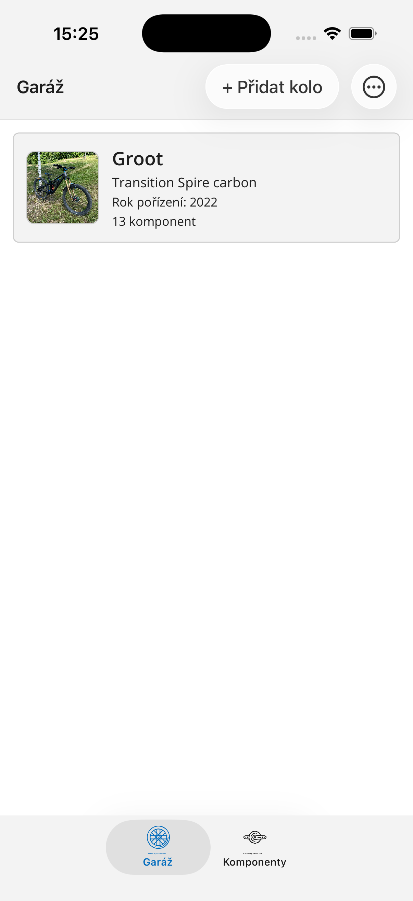
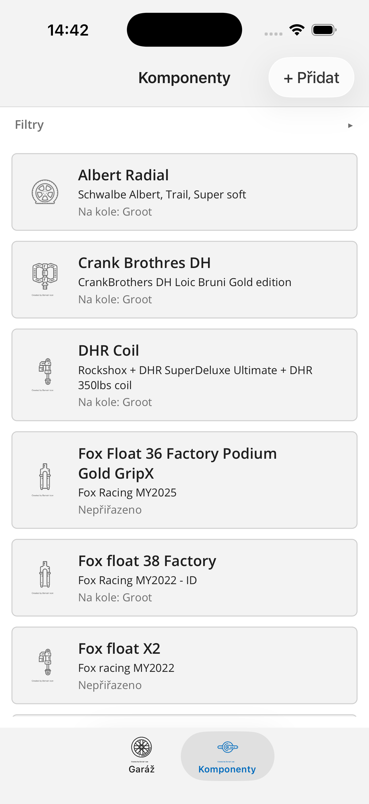
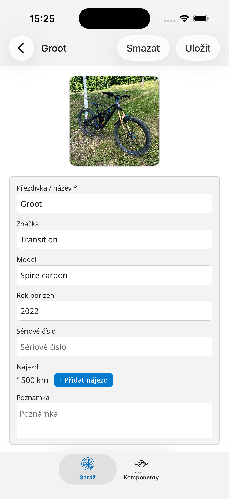
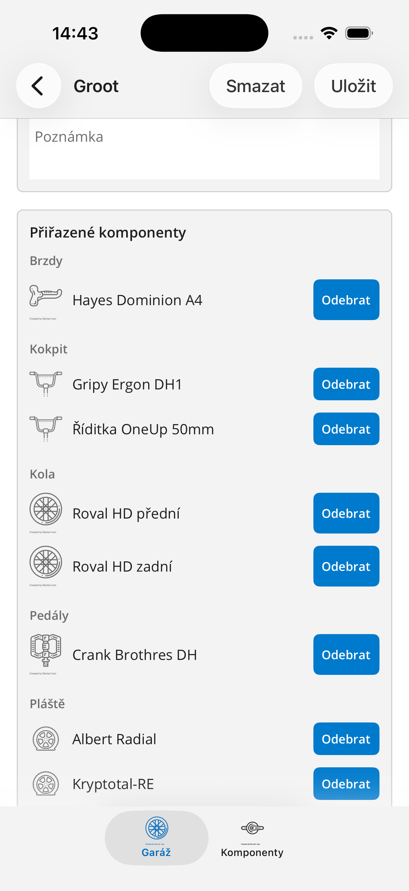
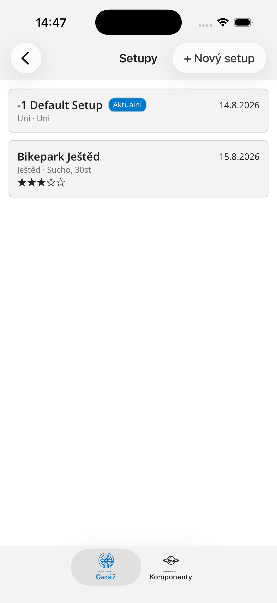
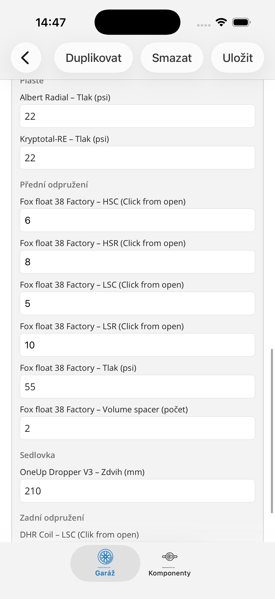

# PogoNote

Aplikace pro správu vlastních horských kol a jejich komponent. Postavená v **.NET MAUI**
(Android / iOS / Mac Catalyst), veškerá data zůstávají lokálně na zařízení — žádný účet, žádný
server, žádný cloud.

## Co PogoNote umí

- **Garáž** — přehled všech kol, foto, značka/model, rok pořízení, nájezd v km.
- **Komponenty** — knihovna dílů (odpružení, kola, pláště, kokpit, pohon, brzdy, pedály, sedlovka…)
  s možností přiřadit/odebrat od konkrétního kola, historií přiřazení a filtrováním podle typu i
  stavu (přiřazeno / nepřiřazeno / vyřazeno).
- **Nastavitelné vlastnosti komponent** — u vidlice, tlumiče, kola apod. lze definovat vlastní
  nastavitelné parametry (komprese, odskok, tlak…), volitelně s pevnou sadou povolených hodnot.
- **Setupy** — uložené sady nastavení pro kolo (datum, lokace, podmínky, hodnocení, poznámka) spolu
  s konkrétními hodnotami na jednotlivých komponentách. Setup si komponenty "pamatuje" v okamžiku
  vytvoření — pozdější výměna dílu na kole starší setupy nijak nezmění.
- **Porovnání setupů** — vedle sebe zobrazí dva setupy stejného kola a zvýrazní, kde se hodnoty (nebo
  rovnou použité komponenty) liší.
- **Export / import dat** — záloha veškerých dat (včetně fotek) do jednoho ZIP souboru a zpětné
  obnovení.

## Ukázky obrazovek

| Garáž | Komponenty |
|---|---|
|  |  |

| Detail kola | Přiřazené komponenty |
|---|---|
|  |  |

| Setupy | Hodnoty setupu |
|---|---|
|  |  |

## Technologie

- .NET MAUI (`net10.0-android`, `net10.0-ios`, `net10.0-maccatalyst`)
- CommunityToolkit.Mvvm + CommunityToolkit.Maui
- SQLite (sqlite-net-pcl) — lokální databáze, žádná síťová komunikace
- Shell navigace, MVVM

## Ochrana soukromí

Aplikace nesbírá ani nikam nepřenáší žádná osobní data — vše zůstává v lokálním úložišti zařízení.
Podrobnosti viz [zásady ochrany osobních údajů](index.html).
